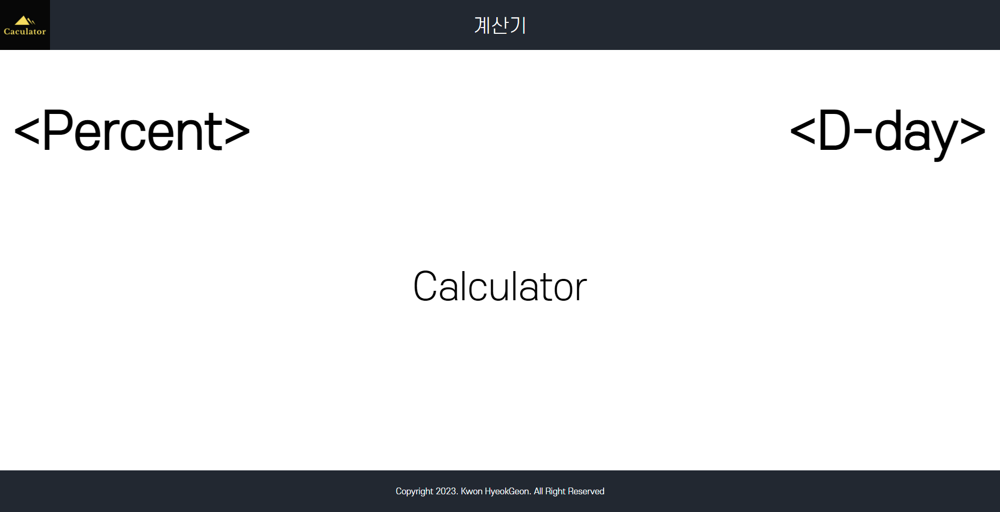

# 프로젝트 이름

   
  Calculator

  
   

## 프로젝트 소개

프로젝트 개요
 
계산기라는 컨셉 아래에 다양한 실생활에 유용한 기능을 제공하기 위하여 디데이계산기와 퍼센트계산기 기능 구현했습니다.

 

## STACK

Vue
 
TailwindCss
 
Vue-router

 

## 구현 기능

### 기능 1
메인 페이지에서 퍼센트와 디데이계산기를 선택하여 이동할 수 있도록 라우터를 설정했습니다.
### 기능 2
각각 계산기의 기능 구현했습니다.
### 기능 3
디데이 계산기에서 디데이날짜를 input type text로 사용자에게 전달 받았을 시 잘못된 형식의 날짜를 입력했을 때의 예외처리가 필요합니다 ex)2023-05-1697. 
 
입력값에 제한을 두거나 형식에 맞지 않는 날짜에 대한 예외처리를 구현 하던 중 디데이 계산기라는 간단한 기능에도 구현이 복잡해지는 것이 모순이라고 생각되어 input type date로 설정하여 구현했습니다.
 

 

